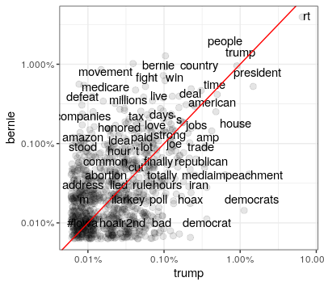

<style>
  body {background-color:lavender}
</style>

# Submission instructions 

Create a folder called **lab1_firstname_lastname**. This folder should contain files called: 

- firstname_lastname_code.R
- firstname_lastname_report.pdf
- firstname_lastname_prediction.txt 

Zip this folder to **lab1_firstname_lastname.zip** and upload it to the link on the homepage. 

# Task


We aim to predict whether or not tweets are made by realDonaldTrump or BernieSanders. This is a useful task if, say, we want to study a certain population on twitter and we would like to know their political views, or if we want to create a left-right/Bernie-Trump index to use as a variable. 

## Data 

The training dataset contains around 2500 tweets from the past few weeks in approximately equal proportions from Bernie and Trump. The test dataset contains 633 unlabelled tweets. You are to predict the labels on the test set. Download all the necessary data [here](https://drive.google.com/drive/folders/1zMsXKxf3Jp3X7HxyFulvJC1GnYLZ0q_-?usp=sharing). 

Some words and hashtags are more frequent from Bernie's tweets than Trump's tweets (medicare, amazon, tax, movement), and other words are more frequent amongst Trump's tweets than Bernie's tweets (hoax, totally, impeachment, media). Such asymetries suggest that we can distinguish Bernie's and Trump's tweets. 

 


Log odds ratio of divisive words: 


## Data cleaning 

Here is some code to help you clean the tweets. You may try cleaning them in other ways as well! 

Set-up and load data: 

```{r, eval = FALSE}
#################
##### SETUP #####
#################

setwd(dirname(rstudioapi::getActiveDocumentContext()$path))

list.of.packages <- c("tidyverse", "stopwords", "tidytext", "scales", "reshape2", "glmnet",
                      "nnls", "quadprog", "SuperLearner", "ggplot2")

new.packages <- list.of.packages[!(list.of.packages %in% installed.packages()[,"Package"])]
if(length(new.packages)) install.packages(new.packages, repos = "http://cran.us.r-project.org")

invisible(lapply(list.of.packages, library, character.only = TRUE))

select <- dplyr::select

#####################
##### READ DATA #####
#####################

train <- read_csv("train.csv")
test <- read_csv("test.csv")
```

Clean special characters and stopwords from tweets. Stopwords are common words that do not contain much information, such as 'and', 'or', 'in'. 

```{r, eval = FALSE}
#######################
##### CLEAN WORDS #####
#######################

## in this part we clean the words in the tweets and create a dataframe in long form (one line per tweet id and per word)

### get rid of stopwords 
stwds = stopwords::stopwords("en", source = "stopwords-iso") 
stwds

replace_reg <- "http[s]?://[A-Za-z\\d/\\.]+|&amp;|&lt;|&gt;"
unnest_reg  <- "([^A-Za-z_\\d#@']|'(?![A-Za-z_\\d#@]))"

tidy_tweets_train <- train %>%
  mutate(Tweet = str_replace_all(Tweet, replace_reg, "")) %>%
  unnest_tokens(
    word, Tweet, token = "regex", pattern = unnest_reg) %>%
  filter(!word %in% stwds, str_detect(word, "[a-z]"))

tidy_tweets_test <- test %>%
  mutate(Tweet = str_replace_all(Tweet, replace_reg, "")) %>%
  unnest_tokens(
    word, Tweet, token = "regex", pattern = unnest_reg) %>%
  filter(!word %in% stwds, str_detect(word, "[a-z]"))
```

Create a dataframe with a list of tweet ids and dummy variables for the top 500 words: 

```{r, eval = FALSE}
#############################
##### GET TOP 500 WORDS #####
#############################

## in this part we want to create a dataframe with a list of tweet ids and dummy variables for the top 500 words

# list of words in train that are also in test
list_of_words = tidy_tweets_train$word[tidy_tweets_train$word %in% tidy_tweets_test$word]

freq_words <- data.frame(word=list_of_words) %>%
  group_by(word) %>%
  mutate(n = n()) %>%
  unique() %>%
  ungroup() %>%
  arrange(-n) %>%
  .[1:500,] %>% # top 500 words
  mutate(word=as.character(word))

tidy_tweets_topwords_train <- tidy_tweets_train %>% 
  mutate(topwords = ifelse(word %in% freq_words$word, 1,0)) %>%
  mutate(word = ifelse(topwords==1, word, "no_top_word")) %>%
  unique() %>%
  group_by(id) %>%
  mutate(notopwords = 1-max(topwords)) %>%
  ungroup() %>%
  filter(!(word=="no_top_word" & notopwords==0)) %>%
  select(-topwords, -notopwords) %>%
  unique() %>%
  dcast(id+Author~word, function(x) 1, fill = 0) 

# saveRDS(tidy_tweets_topwords_train, "train_top500_words.rds")

head(tidy_tweets_topwords_train)

tidy_tweets_topwords_test <- tidy_tweets_test %>% 
  mutate(topwords = ifelse(word %in% freq_words$word, 1,0)) %>%
  mutate(word = ifelse(topwords==1, word, "no_top_word")) %>%
  unique() %>%
  group_by(id) %>%
  mutate(notopwords = 1-max(topwords)) %>%
  ungroup() %>%
  filter(!(word=="no_top_word" & notopwords==0)) %>%
  select(-topwords, -notopwords) %>%
  unique() %>%
  dcast(id~word, function(x) 1, fill = 0) 

# saveRDS(tidy_tweets_topwords_test, "test_top500_words.rds")

head(tidy_tweets_topwords_test)
```

Word embeddings is a method to map words into a 300 dimensional space that preserves certain characteristics of words. For example, similar words will be close together in the 300 dimensional space, so by converting words into vectors embeddings, we can model tweets by their *meaning*, not just by the words that they contain. We do this by taking the mean of the word embeddings of the words in the tweets.

](word2vec.png)

The file GoogleNews-vectors-negative300-SLIM.txt contains an abridged version of word embeddings (300k words). The [original](https://code.google.com/archive/p/word2vec/) contains 3 million words.

```{r, eval = FALSE}
###############################
##### GET WORD EMBEDDINGS #####
###############################

## in this part we want to get the word embeddings in 300 dimensional space for all the words in the tweets

w2v <- read_lines("/media/hannah/hdd/GoogleNews-vectors-negative300-SLIM.txt")
# from https://github.com/eyaler/word2vec-slim/blob/master/GoogleNews-vectors-negative300-SLIM.bin.gz

words_embeddings_w2v <- regmatches(w2v, regexpr(" ", w2v), invert = TRUE) %>% unlist(.)
words_w2v = words_embeddings_w2v[c(TRUE, FALSE)]
embeddings_w2v = words_embeddings_w2v[c(FALSE, TRUE)]

list_of_words_test_train = c(tidy_tweets_train$word, tidy_tweets_test$word) %>% .[!duplicated(.)]

w2v_mat = matrix(nrow = length(list_of_words_test_train), ncol = 300)
for (i in 1:length(list_of_words_test_train)){
  j = which(words_w2v %in% list_of_words_test_train[i])
  tryCatch({
    w2v_mat[i,] = as.numeric(unlist(strsplit(embeddings_w2v[j], " ")))
  }, error = function(e) {
    print(paste("Cannot find ", list_of_words_test_train[i]))
  })
}

word2vec_df = data.frame(w2v_mat)
word2vec_df = cbind(word= list_of_words_test_train, word2vec_df)
word2vec_df <- word2vec_df[complete.cases(word2vec_df),]

head(word2vec_df)
```

In this part we want to create a dataframe with a list of tweet ids and word embeddings. We also add dummy variables for top words that are not embedded. We take the average of the word embeddings for each tweet.

```{r, eval = FALSE}
################################
##### TIDY WORD EMBEDDINGS #####
################################

## in this part we want to create a dataframe with a list of tweet ids and word embeddings. We also add dummy variables for top words that are not embedded
## we take the average of the word embeddings for each tweet

### train ### 

tidy_w2v_train_1 <- tidy_tweets_train %>% # gets top 500 words not in w2v
  filter(word %in% freq_words$word & !(word %in% word2vec_df$word)) %>%
  unique() %>%
  dcast(id+Author~word, function(x) 1, fill = 0) %>%
  select(-Author)
  
tidy_w2v_train_2 <- tidy_tweets_train %>% # gets word embeddings
  left_join(word2vec_df, by ="word") %>%
  filter(complete.cases(.)) %>%
  select(-word, -Author) %>%
  group_by(id) %>%
  summarise_all(funs(mean(.))) %>%
  ungroup()

tidy_w2v_train <- tidy_tweets_topwords_train %>% # combines previous two
  select(id, Author) %>%
  left_join(tidy_w2v_train_2, by="id") %>%
  left_join(tidy_w2v_train_1, by="id") 

tidy_w2v_train[is.na(tidy_w2v_train)] = 0

### test ### 

tidy_w2v_test_1 <- tidy_tweets_test %>% # gets top 500 words not in w2v
  filter(word %in% freq_words$word & !(word %in% word2vec_df$word)) %>%
  unique() %>%
  dcast(id~word, function(x) 1, fill = 0) 

tidy_w2v_test_2 <- tidy_tweets_test %>% # gets word embeddings
  left_join(word2vec_df, by ="word") %>%
  filter(complete.cases(.)) %>%
  select(-word) %>%
  group_by(id) %>%
  summarise_all(funs(mean(.))) %>%
  ungroup()

tidy_w2v_test <- tidy_tweets_topwords_test %>% # gets top 500 words not in w2v
  select(id) %>%
  left_join(tidy_w2v_test_2, by="id") %>%
  left_join(tidy_w2v_test_1, by="id") 

tidy_w2v_test[is.na(tidy_w2v_test)] = 0
```

## Prediction

Use the cleaned data from the code above (`tidy_tweets_topwords_train` or `tidy_w2v_train`) to train your model. You can also clean the data in another way. Some tips: 

- Create your own test set with labels to test your models trained on the training set. Try to predict what your score will be on the unlabelled data using the labelled data that you have. Beware of overfitting, and remember training and testing on the same data will give you a biased estimate of the error on the unlabelled data

- Use the option `family = binomial()` for categorical data 

- Turn the Author variable into a dummy variable with `1=bernie`

- Use screening methods to reduce dimensionality first. 

- Reduce the dataset and/or don't do cross validation (=0) for faster computation speed, and validate your methods on your own validation sets. 

- XGBoost is a method based on decision trees, but is faster than random forests. Approaches such as the elastic net (lasso, ridge), linear regression and SVM should also be fast.

**Note on PCA: **
If you are going to use PCA to reduce dimension, then make sure you 'train' the dimensions on your training set, then project your validation data onto these dimensions (code example below).

```{r, eval = FALSE}
library("FactoMineR")

### training set 
pcares <- PCA(training_data, ncp = 30, graph = FALSE)
training_data_pca <- pcares$ind$coord

### validation set
pcapred <- predict.PCA(pcares, data.frame(validation_data))
validation_data_pca <- pcapred$coord
```

## Submission 

You will need to submit your predictions for the test set. The format for this is **very precise** as it will be graded automatically. Please create a **.txt** file with exactly 633 lines for the 633 tweets in the test set. Each line should contain 1 or 0, where 1 is Bernie and 0 is Trump. No headers, no commas, no semi-colons, no .csv, just 633 lines **in order of tweet id** with 0s and 1s saved as **.txt**. 

More important than the performance of your predictions on the test set is your report. The report should be less than 1 page, and should contain a description of your methodology, the parameters you chose, the performance of your model, the difficulties you faced and suggestions for improving the predictions. 

Finally, please submit clean and documented code. 

## Grading 

This homework is worth 4 marks: 1 mark for clean code, 2 marks for your report and 1 mark for good performance on the test set.
