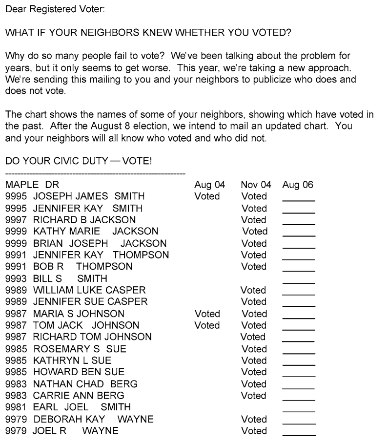

<style>
  body {background-color:lavender}
</style>

# Submission instructions 

Create a folder called **lab2_firstname_lastname**. This folder should contain files called: 

- firstname_lastname_k2ml.R (function in part 2)
- firstname_lastname_code.R (code for part 3 only)
- firstname_lastname_report.pdf (1 page, answers to questions in parts 1, 2 and 3)

Zip this folder to **lab2_firstname_lastname.zip** and upload it via the link on the homepage. (No other compression formats like .tar.gz and .rar please.)

**If you make an error in your submission, just upload it again. I will consider the latest version.**

# Task 

## Part 1: Lab session revision

Fill in the following table covered during the lab session. You may add extra rows or columns if you would like. You can also change the parameters of the data generating process if you like, such as having fewer observations or variables. In one paragraph, comment on the results of the table. 

Method | Estimate of $\beta$ (true $\beta$ = 1)
----------| ------
OLS    | ??
Lasso (point 1)     | ??
Lasso as screening method + OLS (point 2) | ??
Naïve Frisch-Waugh + ML method of choice (point 3) | ??
Frisch-Waugh with sample splitting + ML method of choice (point 4) | ??
Double machine learning (point 5) | ??

## Part 2: An extension of double ML

In double ML, we split the data into two samples, then essentially obtain an estimate for $\beta$ using each of the two samples as training sets. How would double machine learning extend to $K$ sample splitting? (This is discussed in Chernozhukov (2018), Double/debiased machine learning for treatment and structural parameters.) Modify the function `doubleml` by adding an additional argument $K$ that splits the data into $K$ samples in order to take an average of the $K$ estimates of $\beta$. What do you think are the advantages and disadvantages of doing $K$ splitting? 

Your function will be tested automatically, and so the name of the function and the names of the arguments (that don't have default values) must be identical to mine. Please call your function `k2ml` and save it as `firstname_lastname_k2ml.R`. The first 8 arguments should be `X`, `W`, `Y`, `K`, `SL.library.X`, `SL.library.Y`, `family.X` and `family.Y`. **Before submission, restart R and check that the following code runs.**

```{r, eval=FALSE}
# Installs packages if not already installed, then loads packages 
list.of.packages <- c("SuperLearner", "clusterGeneration", "mvtnorm", "xgboost")
new.packages <- list.of.packages[!(list.of.packages %in% installed.packages()[,"Package"])]
if(length(new.packages)) install.packages(new.packages, repos = "http://cran.us.r-project.org")

invisible(lapply(list.of.packages, library, character.only = TRUE))

source('/home/hannah/repos/pse-ml/lab2/hannah_bull_k2ml.R') #### Put path to your file here

### generate_data() is the data generating process from class ### 
generate_data <- function(N=500, k=50, true_beta=1) {
  b=1/(1:k)
  
  # = Generate covariance matrix of w = #
  sigma=genPositiveDefMat(k,"unifcorrmat")$Sigma
  sigma=cov2cor(sigma)
  
  w=rmvnorm(N,sigma=sigma) # Generate w
  g=as.vector(cos(w%*%b)^2) # Generate the function g 
  m=as.vector(sin(w%*%b)+cos(w%*%b)) # Generate the function m 
  x=m+rnorm(N) # Generate x
  y=true_beta*x+g+rnorm(N) # Generate y
  
  dgp = list(y=y, x=x, w=w)
  
  return(dgp)
}
my_data <- generate_data()

res <- k2ml(X=my_data$x, 
            W=my_data$w, 
            Y=my_data$y, 
            K=5, 
            SL.library.X = "SL.xgboost", 
            SL.library.Y = "SL.xgboost", 
            family.X = gaussian(), 
            family.Y = gaussian())

print(c('beta estimate is :', res[1])) 
print(c('SE estimate is :', res[2])) 
```

## Part 3: An application

[**Data download link**](https://drive.google.com/open?id=1rGm7Ny5QKfK46B99xXDJPrIoagOO0HjH)

We aim to apply the double machine learning function to real data. The following part is based on the article "Social Pressure and Voter Turnout: Evidence from a Large-Scale
Field Experiment" by Gerber, Green and Larimer (2008) ([link](https://isps.yale.edu/sites/default/files/publication/2012/12/ISPS08-001.pdf)). The article is about a very large field study where registed voters in the US were randomly selected and received letters encouraging them to vote. As the electoral role in the US is public and one can consult who voted, the researchers were able to analyse the effect of the letters on voter turnout. The data contains variables relating to the treatment ($X$), response ($Y$) and socio-electoral characteristics ($W$). We want to use double machine learning to estimate the coefficient $\beta$ of $X$. 

One of the letters which had a strong effect on turnout is about whether or not one's neighbours voted: 



Receiving this letter led to an 8 percentage point increase in turnout, according to the article. We aim to reproduce this article using double machine learning. In particular, we are interested in the effect of the variable `treat_neighbors` on the variable `outcome_voted`. 

This time, the political party organising the letter campaign does not want to run a randomised control trial, because it is too costly to send letters to non-priority areas. Instead, the political party chooses to send letters by a complicated non-linear targeting model, based upon observable characteristics. This targeting model supposedly will attract more priority voters to turn up at the election. As we now know how to control for variables in a flexible non-linear way, we should still be able to estimate the effect of `treat_neighbors` on the variable `outcome_voted`, despite the non-random sample. 

Carefully construct an estimator for the effect of the variable `treat_neighbors` on the variable `outcome_voted` using double machine learning. You should particularly think about how to choose the ML method to predict $Y$ from $W$ and to predict $X$ from $W$. You may also test your $K$ splitting from part 2. How do your results compare to those in the original paper? How do your results compare to OLS, with and without controlling for $W$?

# Grading 

This homework is worth 4 marks: Part 1 table (0.5), Part 1 analysis (0.5), Part 2 function (1), Part 2 analysis (0.5), Part 3 code (0.5), Part 3 analysis (1).
