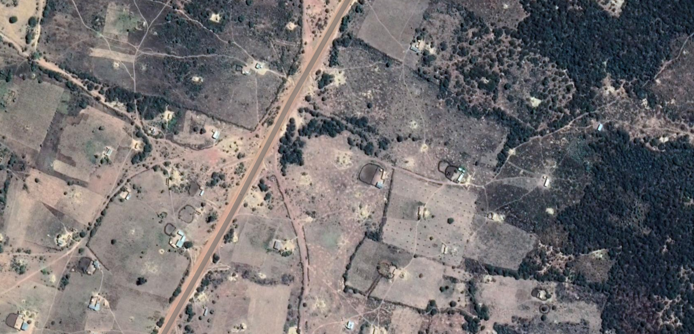

<style>
  body {background-color:lavender}
</style>

```{r setup, include=FALSE}
require(knitr)
knitr::opts_chunk$set(echo = TRUE)
#knitr::opts_knit$set(root.dir = "/home/hannah/repos/mlinecon/lab1")
require("SuperLearner")
require("ggplot2")
require("raster")
require("sp")
require("rgdal")
require("rgeos")
require("FactoMineR")
require("KernelKnn")
require("randomForest")
require("glmnet")
require("Matrix")
require("foreach")
require("caret")

set.seed(123)
```


# Introduction

The goal of this lab session is to try out a number of classic machine learning techniques and ensemble learning using R in order to train a model to estimate poverty from satellite data. We will use the R package `SuperLearner`.

This lab session is based on the paper "Combining Satellite Imagery and Machine Learning to Predict Poverty" (@jean2016combining). Information on this project can also be found [at this website](http://sustain.stanford.edu/predicting-poverty/) and [here on Github](https://github.com/nealjean/predicting-poverty). **Disclaimer**: I have nothing to do with this project, I simply chose this topic as an example of applied machine learning in an innovative domaine of economics. 

Satellites take high-resolution images of every location on earth every day, making satellite data a useful source of development indicators where other reliable data, such as census or survey data, is scarce. Nightlights have frequently been used to measure income; for example, @martinez2018much use nightlights data to suggest that countries such as Russia and China over-report GDP. @jean2016combining shows that using daytime satellite images in addition to nightlights improves estimates of consumption and assets in numerous sub-saharan African countries. 

In this lab session, we will reproduce and develop aspects of the latter paper. 

We will train a model to estimate consumption using both daytime and nighttime satellite images. Here, we will try numerous machine learning algorithms to predict the outcome as well as ensemble learning techniques to either choose the best method or stack multiple models together to find a better ensemble method. We will use cross-validation methods to select the best performing model.

# Set-up

## Installing and loading packages

Install the following packages in R: nnls, quadprog, SuperLearner, ggplot2, raster, sp, rgdal, rgeos, glmnet, Matrix, foreach, KernelKnn, randomForest.

```{r installpackages, eval=F}
list.of.packages <- c("nnls", "quadprog", "SuperLearner", "ggplot2", "raster", "sp", "rgdal", "rgeos", "glmnet", "Matrix", "foreach", "KernelKnn", "randomForest")
new.packages <- list.of.packages[!(list.of.packages %in% installed.packages()[,"Package"])]
if(length(new.packages)) install.packages(new.packages, repos = "http://cran.us.r-project.org")

invisible(lapply(list.of.packages, library, character.only = TRUE))
```

## Downloading data

Download the cleaned data [here](https://drive.google.com/drive/folders/1N2fNw1wPTlKkb512QzQJj-PSBjWri1eK?usp=sharing). 

The source data are the LSMS surveys for Tanzania and for Nigeria for 2012-2013 from the World Bank website. (http://surveys.worldbank.org/lsms/programs/integrated-surveys-agriculture-ISA)

## Changing working directory

Change your working directly to the source folder. 

```{r, eval=FALSE}
# My working directory
setwd("/home/hannah/repos/mlinecon/lab1")
```

# Understanding the data

In this section, we create a database of nightlights and features of daytime satellite images, and use this database to predict consumption. 

We want to *train* our model on *Tanzania*, then *test* our model on *Nigeria*. The folders `train` and `test` are have identical formats except for the former contains Tanzanian data and the latter contains Nigerian data. 

## Load nightlight data

Load the following datasets from the folders "train" and "test": 

1. nightlights.tif - This is an image of the nightlights in Tanzania/Nigeria from 2013, downloaded from https://www.ngdc.noaa.gov/

2. clusters (shapefile) - This is the geographical data from the Tanzanian/Nigerian survey data 

3. countryoutline (shapefile) - This is the outline of Tanzania/Nigeria, not necessary except to make a nice plot

```{r adddata}
# train
nightlightstif <- raster("train/nightlights.tif")
clusters <- readOGR("train/shapefiles/", "clusters", verbose = FALSE) #remove final / if does not work
countryoutline <- readOGR("train/shapefiles/", "countryoutline", verbose = FALSE) #remove final / if does not work

# test
nightlightstif_test <- raster("test/nightlights.tif")
clusters_test <- readOGR("test/shapefiles/", "clusters", verbose = FALSE) #remove final / if does not work
countryoutline_test <- readOGR("test/shapefiles/", "countryoutline", verbose = FALSE) #remove final / if does not work
```

Display the luminosity of the nightlights and add the shapefile of the cluster blocks from the household survey data.
 
```{r nightlightsnigeria}
plot(nightlightstif)
plot(countryoutline, bg="transparent", add=TRUE)
plot(clusters, bg="transparent", add=TRUE)
```

Zoom in to one of the cluster blocks from the household survey data. 

```{r nightlightsnigeriablock}
### Zoom in to a block
temp <- crop(nightlightstif, clusters[clusters@data$ID==247,]) 
plot(temp)
#plot(clusters, bg="transparent", add=TRUE)
```

### Compute mean luminosity for survey blocks

The highlighted code below computes the mean luminosity from each survey block from the ```.tif``` file and puts it in a vector with the mean luminocity for each cluster. This vector is then saved as `nightlights.rds`. The code takes a few minutes to run, so you can either run it yourself or simply load the `nightlights.rds` file. 

```{r getnightlightfeatures}
# nightlights_get <- c()
# for (i in 1:length(clusters@data$ID)){
#   nig_nightlights_crop <- crop(nightlightstif, clusters[clusters@data$ID==i,])
#   nightlights_get <- c(nightlights_get, mean(nig_nightlights_crop@data@values))
#   print(i)
# }
# saveRDS(nightlights_get, "train/nightlights.rds")
nightlights <- readRDS("train/nightlights.rds")

# nightlights_get <- c()
# for (i in 1:length(clusters_test@data$ID)){
#   nig_nightlights_crop <- crop(nightlightstif_test, clusters_test[clusters_test@data$ID==i,])
#   nightlights_get <- c(nightlights_get, mean(nig_nightlights_crop@data@values))
#   print(i)
# }
# saveRDS(nightlights_get, "test/nightlights.rds")
nightlights_test <- readRDS("test/nightlights.rds")
```

## Load consumption data

Load the consumption data for each survey block. 

```{r loadcons}
consumptions <- readRDS("train/consumptions.rds")
consumptions_test <- readRDS("test/consumptions.rds")
```

### Plot the relationship between consumption and mean luminosity

Create a scatter plot of consumption and mean luminocity.  

```{r firstapplysl}
ggplot(data.frame(consumptions, nightlights), aes(nightlights, consumptions)) + geom_point() + geom_smooth(method = "loess") + ggtitle("Tanzania")
ggplot(data.frame(consumptions_test, nightlights_test), aes(nightlights_test, consumptions_test)) + geom_point() + geom_smooth(method = "loess")+ggtitle("Nigeria")
```

## Load daytime features



This is the black box of today's class. We will not go into detail on how to obtain the daytime satellite features, but it uses classic computer vision methods. The implementation code is [here on Github](https://github.com/nealjean/predicting-poverty). 

1. Train a convolutional neural network to predict nightlights from daytime Google maps images. This is done by modifying existing convolutional neural networks commonly used for image analysis. 

2. Use this convolutional neural network to extract 4096 features of daytime images that are good predictors of nightlights. We do not know exactly what these features are as they are they are automatically extracted from a model with millions of parameters. However, they are likely to vaguely correspond to image features such as roads, buildings, vegetation, agriculture... 

3. For this class, I use principal component analysis to extract 30 features from these 4096 features. This results in a minor loss of information but saves on computational time. 

```{r loadday}
feats <- readRDS("train/features.rds")
feats_test <- readRDS("test/features.rds")
```

## Make final train and test sets

We combine the nightlights data with the daytime features to make our training and testing sets. 

```{r combine}
training <- data.frame(nightlights, feats)
testing <- data.frame(nightlights=nightlights_test, feats_test)
```

# Machine learning to predict consumption

We will now use basic machine learning techniques to predict consumption using nightlights and daytime features in order to demonstrate the functionalities of the R package SuperLearner.

## Key steps in training a model 

* Exclude a test set 
* Estimate parameters of models on the training set
* Use cross-validation on the training set to estimate the errors of these models
* Pick the best model or use ensemble methods to optimally stack models together
* Estimate the error on the test set, and do not touch your model after this! 

## SuperLearner with R

The R package Superlearner is a simple way to implement a wide library of machine learning algorithms and to choose the best algorithm using cross validation and ensemble methods. 

The key arguments of the function SuperLearner are: 

Argument      | Description
------------- | -------------
Y (required)             | Vector of Y values
X (required)          | Dataframe of X values
SL.library (required)  | ML algorithm
verbose | Print details (TRUE/FALSE)
family        | Distribution of error terms (e.g. gaussian() or binomial())
method | Method for estimating super learner coefficients (default: Non-negative least squares)
id | Cluster id variable
obsWeights | Observation weights
cvControl | Method for cross validation control, e.g. to change the number of folds

A list of functions available for the value of SL.library can be found by typing ```listWrappers()```. Some key functions are as follows: 

Values for SL.library      | Description
------------- | -------------
SL.lm | Linear model
SL.glm | Generalised linear model
SL.glmnet | Penalised regression using elastic net (alpha=0 for ridge, alpha=1 for lasso)
SL.bartMachine | Bayesian additive regression trees
SL.randomForest | Random forest
SL.kernelKnn | K nearest neighbours 
SL.ksvm | Support vector machine

For example, we can estimate a linear model on our training data. 

```{r linmod}
set.seed(123)
sl_lm = SuperLearner(Y = consumptions, 
                     X = training, 
                     family = gaussian(), 
                     SL.library = "SL.lm", 
                     cvControl = list(V=5))
sl_lm
```

The value "Risk" is the mean squared error as estimated using 5-fold cross validation. The value "Coef" is the weight allocated to this model by the super learner. As we only have one model, the weight is 1. 

The estimate of the coefficients can be found in the object ```sl_lm``` as ```sl_lm$fitLibrary$SL.lm_All$object$coefficients```.

## Ensemble methods

Given 3 different estimators of $Y$, called $\hat{Y}_1$, $\hat{Y}_2$, $\hat{Y}_3$, we can compute a new estimator of $Y$ by linearly combining the three. We can do this by estimating the equation: 

$Y = \alpha_1 \hat{Y}_1 + \alpha_2 \hat{Y}_2 + \alpha_3 \hat{Y}_3 + \varepsilon$ 

where $\alpha_1$, $\alpha_2$ and $\alpha_3$ are positive. This model can be estimated using non-negative least squares. If the model $\hat{Y}_3$ is not helpful in predicting $Y$, then we expect $\alpha_3$ to be 0. We expect the highest value of $\alpha$ to correspond to the best model. 

Using this ensembling method, we can compare a linear model with a k-nearest neighbours model. 

```{r 2modssl}
sl_2 = SuperLearner(Y = consumptions, 
                    X = training, family = gaussian(), SL.library = c("SL.lm", "SL.kernelKnn"), 
                    cvControl = list(V=5))
sl_2
```

The linear model performs better than the k-nearest neighbours model. However, here, our super learner optimally combines the k-nearest neighbours model with the linear model to give a model better than both. A weight of about 0.4 is given to the k-nearest neighbours model and a weight of about 0.6 is given to the linear model. To get an estimation of the risk of the super learner using cross validation, we use the command CV.SuperLearner. 

```{r cvsl2}
cv_sl_2 = CV.SuperLearner(Y = consumptions, 
                    X = training, family = gaussian(), SL.library = c("SL.lm", "SL.kernelKnn"), 
                    cvControl = list(V=5))
summary(cv_sl_2)
plot(cv_sl_2)
```

## Model classes

### Elastic net models 

An important class of models that we will study in this class is the elastic net. 

Lasso and ridge regularisation are special cases of the elastic net. The elastic net finds $\beta_0$ and $\beta$ that minimise: 

\[\min_{\beta_0, \beta} \frac{1}{N} \sum_{i=1}^N (y_i-\beta_0 - \beta^Tx_i)^2 + \lambda\left[(1-\alpha)||\beta||_2^2/2+\alpha||\beta||_1\right].\]

This is just *penalised least squares regression*. The first term is least squares as you know it. The last term involves a complexity parameter $\lambda$ (the higher the $\lambda$ the lower the complexity) and another parameter $\alpha$. The parameter $\alpha$ controls how much $L_2$ and $L_1$ norm weight we put on the $\beta$. This has an effect of selecting only the most important variables for the prediction.

When $\alpha=1$ we use the $L_1$ norm and call this *lasso* regression. When $\alpha=0$ we use the $L_2$ norm and call this *ridge* regression. 

```{r}
ridge = create.Learner("SL.glmnet", params = list(alpha = 0), name_prefix="ridge")
lasso = create.Learner("SL.glmnet", params = list(alpha = 1), name_prefix="lasso")

sl_libraries <- c(lasso$names, ridge$names)
sl_en <- SuperLearner(Y = consumptions,
                      X = training, 
                      family = gaussian(),
                      SL.library = sl_libraries, 
                      cvControl = list(V=5))
sl_en
```

### Random forest model

We will study decision trees and random forests in more detail later during this course. Random forests are a mean of decision trees. 

We can tune the ```mtry``` parameter in the random forest learner. This parameter is the number of variables selected at each node of a decision tree to split the tree.

```{r tuning}
mtry = create.Learner("SL.randomForest", tune = list(mtry = c(2,3)), name_prefix="mtry")
sl_libraries <- mtry$names
sl_mtry <- SuperLearner(Y = consumptions,
                        X = training, 
                        family = gaussian(),
                        SL.library = sl_libraries, 
                        cvControl = list(V=5))
sl_mtry
```

## Screening algorithms in SuperLearner

Screening algorithms reduce the dimension of the predictors, before applying a predictive algorithm. The syntax of the screening algorithm in SuperLearner is:

``` SL.library=list(c("SL.pred_1", "screen.scr_1"), c("SL.pred_2", "screen.scr_2"), "SL.pred_3") ```

Some common screening algorithms in the package are: 

Values for SL.library      | Description
------------- | -------------
screen.corP | Selects variables correlated with the outcome
screen.glmnet | Selects variables using lasso
screen.randomForest | Selects variables using random forests

In order to screen variables using lasso, we can do the following: 

```{r screens}
sl_libraries <- list(c("SL.randomForest", "screen.glmnet"), lasso$names, ridge$names)
sl_screen <- SuperLearner(Y = consumptions,
                          X = training, family = gaussian(),
                          SL.library = sl_libraries, cvControl = list(V=5))
sl_screen
```

# Testing our model

We can now apply this model to the test set: data from Nigeria.  

```{r loadtestset}
pred <- predict(sl_screen, testing, onlySL = T)
```

We plot consumption as measured by surveys against the predicted consumption, and compute the mean squared error. 

```{r teststats}
ggplot(data.frame(consumptions_test, pred$pred), aes(pred$pred , consumptions_test)) + geom_point() + geom_abline(slope=1, intercept=0)

mse = mean((consumptions_test-pred$pred)^2)
print(paste("Mean squared error:", round(mse, digits=4)))

print(paste("Correlation:", round(cor(consumptions_test,pred$pred), digits=4)))
```

# Bibliography

SuperLearner package: https://cran.r-project.org/web/packages/SuperLearner/SuperLearner.pdf

