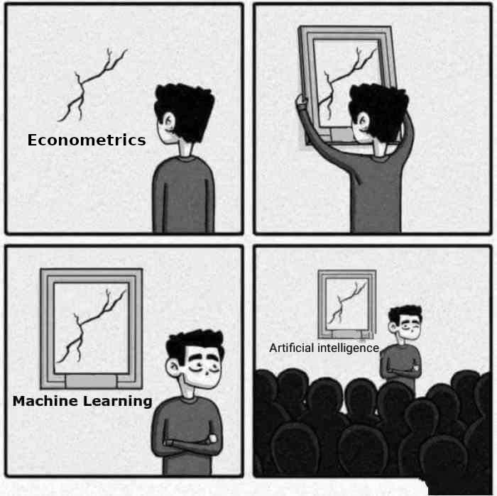
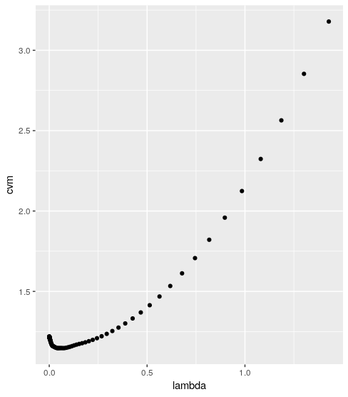
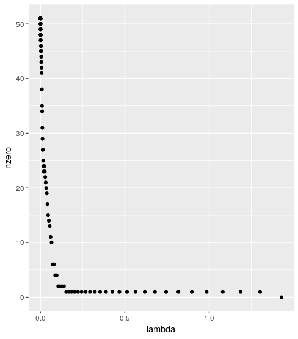
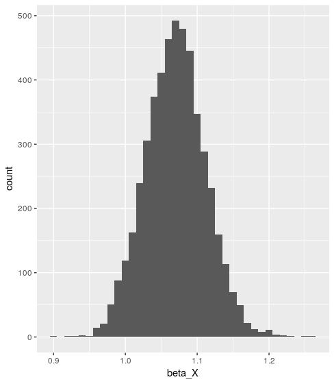

<style>
  body {background-color:lavender}
</style>




# Goal

Last lab, we covered prediction methods. Such methods are not developed to estimate **causality**, which as econometricians is what we are most interested in. Nevertheless, there are some links between the prediction methods we have covered and causality. Linear regression is a machine learning method: we are trying to find the **best predictor** of $Y$ given $X$, assuming that $E[Y|X]$ has a linear form. It just so happens that (under some assumptions) we can call the coefficients $\beta$ of this linear form "causal effects". This leads us to ask whether or not there are other machine learning methods that we can use to estimate a "causal effect" $\beta$. 

We can think of the link between prediction and causality in terms of counter-factuals. Assume we have a treatment $X \in \{0,1\}$ that causes an outcome $Y$, with controls $W$. The effect of a treatment on an individual $i$ is $E(Y_i|X_i=1, W_i) - E(Y_i|X_i=0, W_i)$, but only one of these terms are observed. The problem is to find a good **predictor** of what would have happened in the counter-factual situation. 

## Structure of today's class 

### Coding up the Double ML estimator in R

1. Lasso/Ridge/Elastic Net give us linear forms for $E[Y|X]$. Can we interpret the coefficients of these linear forms as causal effects, as we do for linear regression?  
2. We covered screening methods last lab. Can we use screening methods such as lasso to select control variables and then apply OLS? 
3. The key model. We assume that we have a flexible model where: 

\[Y = \beta X + g(W) + U \] 
\[X = m(W) + V\]

with $E(U|X,W)=0$ and $E(V|W)=0$. The functions $m$ and $g$ can be (essentially) anything. In this scenario, $\beta$ is the linear effect of $X$ on $Y$, controlling for $W$ in a flexible way. By subtracting the expectation given $W$ from both sides, we can rewrite this as: 

\[(Y - E(Y|W))=\beta(X - E(X|W)) + \varepsilon.\]

We are now good at predition methods, so we should be able to use any machine learning method to estimate $E(Y|W)$ and $E(X|W)$, i.e. predict $Y$ given $W$ and predict $X$ given $W$. We can then have all the quantities we need to get $\beta$ by running a simple linear regression (Frisch-Waugh). Does this give an unbiased estimate? 

4. Last week we talked about sample splitting and cross-validation to avoid bias. Should we split samples here? How and why? 

5. We code the double ML estimator.

We will fill in the below table:

**Table of results**

Method | Estimate of $\beta$ (true $\beta$ = 1)
----------| ------
OLS    | ??
Lasso (point 1)     | ??
Lasso as screening method + OLS (point 2) | ??
Naïve Frisch-Waugh + ML method of choice (point 3) | ??
Frisch-Waugh with sample splitting + ML method of choice (point 4) | ??
Double machine learning (point 5) | ??

(*Note*: When we talk about causal effects today, we are simply talking about estimation. Notably, we assume that there is no omitted variable bias and that $X$ does in fact cause $Y$.) 

# Set-up 

Install and load the packages `SuperLearner` and `ggplot2`. 

```{r, eval=FALSE}
# Installs packages if not already installed, then loads packages 
list.of.packages <- c("SuperLearner", "ggplot2", "glmnet", "clusterGeneration", "mvtnorm", "xgboost")
new.packages <- list.of.packages[!(list.of.packages %in% installed.packages()[,"Package"])]
if(length(new.packages)) install.packages(new.packages, repos = "http://cran.us.r-project.org")

invisible(lapply(list.of.packages, library, character.only = TRUE))
``` 

## Data Generating Process 

In the first part of today's lab session, we will use generated data. We create a function called `generate_data`, which generates a matrix with $N$ observations of $k+1$ dependent variables for us to use. We generate: 

\[Y = \beta X + g(W) + U \] 
\[X = m(W) + V\]

where $W$ are some correlated random variables, $g$ is a cosine-squared function, $m$ is a sum of a cosine and and a sine function and $U$ and $V$ are randomly distributed normal errors. 

```{r, eval=FALSE}
generate_data <- function(N=500, k=50, true_beta=1) {
  # DGP inspired by https://www.r-bloggers.com/cross-fitting-double-machine-learning-estimator/ 
  # Generates a list of 3 elements, y, x and w, where y and x are N 
  # times 1 vectors, and w is an N times k matrix. 
  #
  # Args:
  #   N: Number of observations
  #   k: Number of variables in w
  #   true_beta: True value of beta
  #
  # Returns:
  #   a list of 3 elements, y, x and w, where y and x are N 
  #   times 1 vectors, and w is an N times k matrix. 
  
  b=1/(1:k)
  
  # = Generate covariance matrix of w = #
  sigma=genPositiveDefMat(k,"unifcorrmat")$Sigma
  sigma=cov2cor(sigma)
  
  w=rmvnorm(N,sigma=sigma) # Generate w
  g=as.vector(cos(w%*%b)^2) # Generate the function g 
  m=as.vector(sin(w%*%b)+cos(w%*%b)) # Generate the function m 
  x=m+rnorm(N) # Generate x
  y=true_beta*x+g+rnorm(N) # Generate y
  
  dgp = list(y=y, x=x, w=w)
  
  return(dgp)
}
``` 

To get a random data set, we run `generate_data()`, or `generate_data(N=..., k=..., true_beta=...)` if we wish to specify the parameters. If you have a slow computer, you may wish to reduce $N$ and $k$. 

```{r, eval=FALSE}
set.seed(123)
dgp <- generate_data()
````

# Coding up the Double ML estimator in R

## Lasso vs OLS coefficients

### Elastic net coefficients

Remember: Lasso and ridge regularisation are special cases of the elastic net. The elastic net finds $\beta_0$ and $\beta$ that minimise:

$$ \min_{\beta_0,\beta} \frac{1}{N} \sum_{i=1}^{N} w_i l(y_i,\beta_0+\beta^T x_i) + \lambda\left[(1-\alpha)||\beta||_2^2/2 + \alpha ||\beta||_1\right] $$ 

We apply ridge, lasso and elastic net regression on our generated data set. We compare these to linear regression. 

```{r, eval=FALSE}
ridge = create.Learner("SL.glmnet", params = list(alpha = 0), name_prefix="ridge")
lasso = create.Learner("SL.glmnet", params = list(alpha = 1), name_prefix="lasso")
en05 = create.Learner("SL.glmnet", params = list(alpha = 0.5), name_prefix="en05")

SL.library <- c(lasso$names, ridge$names, en05$names, "SL.lm")
sl_en <- SuperLearner(Y = dgp$y,
                      X = data.frame(x=dgp$x, w=dgp$w), 
                      family = gaussian(),
                      SL.library = SL.library, 
                      cvControl = list(V=5))
sl_en
```

We study the coefficients of OLS, lasso, ridge and en05. **Questions:** What is the true coefficient of $x$? What do we expect it to be for OLS, lasso, ridge and en05? How do we expect the coefficients to change with $\lambda$? 

```{r, eval=FALSE}
coef(sl_en$fitLibrary$SL.lm_All$object)[1:20] # first 20 OLS coeffs

lasso_coeffs <- data.frame(lambda = sl_en$fitLibrary$lasso_1_All$object$lambda) # what is this object?
lasso_coeffs$nzero <- sl_en$fitLibrary$lasso_1_All$object$nzero # what is nzero? 
lasso_coeffs$cvm <- sl_en$fitLibrary$lasso_1_All$object$cvm # what is cvm? 

ggplot(lasso_coeffs, aes(x=lambda, y=nzero)) + geom_point() # explain this graph
ggplot(lasso_coeffs, aes(x=lambda, y=cvm)) + geom_point() # explain this graph

optimal_cv = which.min(lasso_coeffs$cvm)

lasso_coeffs$lambda[optimal_cv] # what does this line do? 
lasso_coeffs$nzero[optimal_cv]
lasso_coeffs$cvm[optimal_cv]

### QUESTION: repeat for ridge and for en05. What do you observe and why? 
```




### Simulations with OLS and lasso

We generate 100 different datasets and estimate the coefficient of $x$ using linear regression. We store this in a vector called `beta_X`. **Question:** What do you expect the mean of the vector `beta_X` to be?

```{r, eval=FALSE}
beta_X = c()
for (i in 1:100) {
  print(i)
  dgp = generate_data()
  
  SL.library <- "SL.lm"
  sl_lm <- SuperLearner(Y = dgp$y,
                        X = data.frame(x=dgp$x, w=dgp$w), 
                        family = gaussian(),
                        SL.library = SL.library, 
                        cvControl = list(V=0))

  beta_X = c(beta_X, coef(sl_lm$fitLibrary$SL.lm_All$object)[2])
}

beta_X_df <- data.frame(beta_X=beta_X)
ggplot(beta_X_df, aes(x = beta_X)) + geom_histogram(binwidth = 0.02)
``` 



We do the same thing for lasso. **Question:** What do you expect the mean of the vector `beta_X` to be?

```{r, eval=FALSE}
beta_X = c()
for (i in 1:100) {
  print(i)
  dgp = generate_data()
  
  SL.library <- ### FILL HERE 
  sl_lasso <- SuperLearner(Y = dgp$y,
                           X = data.frame(x=dgp$x, w=dgp$w), 
                           family = gaussian(),
                           SL.library = SL.library, 
                           cvControl = list(V=0))

  beta_X = c(beta_X, coef(sl_lasso$fitLibrary$lasso_1_All$object, s="lambda.min")[2])
}

beta_X_df <- data.frame(beta_X=beta_X)
ggplot(beta_X_df, aes(x = beta_X)) + geom_histogram(binwidth = 0.02)
``` 

## Lasso as a screening algorithm (Post-Lasso)

The coefficients of lasso are biased towards zero. Can we then just use lasso as a screening algorithm before applying OLS to get unbiased coefficients? As in the previous code block, generate 100 different datasets and estimate the coefficient of $x$ using lasso as a screening algorithm and a linear model for prediction. We store this in a vector called `beta_X`. **Question:** What do you expect the mean of the vector `beta_X` to be?

```{r, eval=FALSE}
beta_X = c()
for (i in 1:100) {
  print(i)
  dgp = generate_data()
  
  SL.library <- list(c("SL.lm", "screen.glmnet"))
  sl_screening_lasso <- SuperLearner(Y = dgp$y,
                      X = data.frame(x=dgp$x, w=dgp$w), family = gaussian(),
                      SL.library = SL.library, cvControl = list(V=0))
    
  # why this if ... else ... ? 
  if (names(sl_screening_lasso$fitLibrary$SL.lm_screen.glmnet$object$coefficients)[2]=="x") { 
    beta_X = c(beta_X, sl_screening_lasso$fitLibrary$SL.lm_screen.glmnet$object$coefficients[2])
  } else {
    beta_X = c(beta_X, 0)
  }
}

beta_X_df <- data.frame(beta_X=beta_X)
ggplot(beta_X_df, aes(x = beta_X)) + geom_histogram(binwidth = 0.02)
``` 

### Forcing post-lasso to keep variables of interest

We can force post-lasso to include our variable of interest, as lasso may omit it. 

```{r, eval=FALSE}
SL.library <- lasso$names
sl_lasso <- SuperLearner(Y = dgp$y,
                         X = data.frame(x=dgp$x, w=dgp$w), 
                         family = gaussian(),
                         SL.library = SL.library, 
                         cvControl = list(V=0))

### useful function to get lasso coefficients:
get_lasso_coeffs <- function(sl_lasso){
  optimal_lambda_index <- which.min(sl_lasso$fitLibrary$lasso_1_All$object$cvm)
  return(sl_lasso$fitLibrary$lasso_1_All$object$glmnet.fit$beta[,optimal_lambda_index])
}

### example of this function:
get_lasso_coeffs(sl_lasso)

kept_variables <- which(get_lasso_coeffs(sl_lasso)!=0) - 1 # minus 1 as X is listed
kept_variables <- kept_variables[kept_variables>0]

sl_screening_lasso <- SuperLearner(Y = dgp$y, 
                                   X = data.frame(x = dgp$x, w = dgp$w[, kept_variables]), 
                                   family = gaussian(),
                                   SL.library = "SL.lm", cvControl = list(V=0))
``` 

### Post-double-selection Lasso

We can also ensure that we add good predictors of the variable of interest $X$. This is proposed in Belloni, Chernozhukov and Hansen (2013), "Inference for high-dimensional sparse econometric models" [(link)](https://core.ac.uk/download/pdf/6673481.pdf). 

```{r, eval=FALSE}
sl_pred_x <- SuperLearner(Y = dgp$x,
                          X = data.frame(w=dgp$w), 
                          family = gaussian(),
                          SL.library = lasso$names, 
                          cvControl = list(V=0))

kept_variables2 <- which(get_lasso_coeffs(sl_pred_x)!=0) 

sl_screening_lasso <- SuperLearner(Y = dgp$y,
                      X = data.frame(x = dgp$x, w = dgp$w[, c(kept_variables, kept_variables2)]), 
                      family = gaussian(),
                      SL.library = "SL.lm", 
                      cvControl = list(V=0))
``` 

We can run the last block 100 times. 

```{r, eval=FALSE}
beta_X = c()
for (i in 1:100) {
  print(i)
  dgp = generate_data()
  
  SL.library <- lasso$names
  sl_lasso <- SuperLearner(Y = dgp$y,
                           X = data.frame(x=dgp$x, w=dgp$w), 
                           family = gaussian(),
                           SL.library = SL.library, 
                           cvControl = list(V=0))
  
  kept_variables <- which(get_lasso_coeffs(sl_lasso)!=0) - 1 # minus 1 as X is listed
  kept_variables <- kept_variables[kept_variables>0]
    
  sl_pred_x <- SuperLearner(Y = dgp$x,
                            X = data.frame(w=dgp$w), 
                            family = gaussian(),
                            SL.library = lasso$names, cvControl = list(V=0))
  
  kept_variables2 <- which(get_lasso_coeffs(sl_pred_x)!=0) 
  kept_variables2 <- kept_variables2[kept_variables2>0]
  
  sl_screening_lasso <- SuperLearner(Y = dgp$y,
                                     X = data.frame(x = dgp$x, w = dgp$w[, c(kept_variables, kept_variables2)]), 
                                     family = gaussian(),
                                     SL.library = "SL.lm", 
                                     cvControl = list(V=0))
  
  beta_X = c(beta_X, coef(sl_screening_lasso$fitLibrary$SL.lm_All$object)[2])
}

beta_X_df <- data.frame(beta_X=beta_X)
ggplot(beta_X_df, aes(x = beta_X)) + geom_histogram(binwidth = 0.02)
``` 

## Finding an interpretable coefficient using other ML methods

###  Frisch-Waugh theorem 

A classic result in econometrics is the Frisch-Waugh theorem. Basically, it says that if we want to estimate $\beta$ in the equation $Y = \beta X + \gamma W + \varepsilon$, we follow the steps: 

1. Regress $X$ on $W$ and obtain the residuals $\hat{v}$ (i.e. $X=\alpha W+v$)
2. Regress $Y$ on $W$ and obtain the residuals $\hat{u}$ (i.e. $Y=\delta W+u$)
3. Regress $\hat{u}$ on $\hat{v}$ and obtain $\hat{\beta}$ as the coefficient, i.e. 

\[\hat{\beta} = \frac{\textrm{cov}(\hat{u},\hat{v})}{\textrm{var}(\hat{v})}\]

Intuitively, this makes sense (not a proof): 
\[Y = \beta X + \gamma W + \varepsilon\]
\[Y - E(Y|W) = \beta(X - E(X|W)) + \varepsilon'\]
\[Y - \delta W = \beta(X - \alpha W) + \varepsilon'\]
\[u = \beta v + \varepsilon'\]

### Naïve Frisch-Waugh

Going back to the introduction, we assume that we have a flexible model where: 

\[Y = \beta X + g(W) + U \] 
\[X = m(W) + V\]

with $E(U|X,W)=0$ and $E(V|W)=0$. The functions $m$ and $g$ can be (essentially) anything. In this scenario, $\beta$ is the linear effect of $X$ on $Y$, controlling for $W$ in a flexible way. By subtracting the expectation given $W$ from both sides, we can rewrite this as: 

\[(Y - E(Y|W))=\beta(X - E(X|W)) + \varepsilon.\]

We are now good at predition methods, so we should be able to use machine learning to estimate $E(Y|W)$ and $E(X|W)$, i.e. predict $Y$ given $W$ and predict $X$ given $W$. We can then have all the quantities we need to get $\beta$ by running a simple linear regression. Does this work? 

```{r, eval=FALSE}
beta_X = c()
for (i in 1:100) {
  print(i)
  dgp = generate_data()

  sl_x = SuperLearner(Y = dgp$x, 
                      X = data.frame(w=dgp$w), # the data used to train the model
                      newX= data.frame(w=dgp$w), # the data used to predict x
                      family = gaussian(), 
                      SL.library = "SL.xgboost", # use whatever ML technique you like
                      cvControl = list(V=0)) 
  x_hat <- sl_x$SL.predict
  sl_y = ## FILL HERE (predict y using w)
  y_hat <- ## FILL HERE (prediction of y)
  res_x = ## FILL HERE (residuals of prediction of x, i.e. true x - predicted x)
  res_y = ## FILL HERE (residuals of prediction of y)
  beta = (mean(res_x*res_y))/(mean(res_x**2)) # (coefficient of regression of res_y on res_x)
  beta_X = c(beta_X, beta)
}

beta_X_df <- data.frame(beta_X=beta_X)
ggplot(beta_X_df, aes(x = beta_X)) + geom_histogram(binwidth = 0.02)
```


### Removing bias using sampling

The problem with this estimation is that it is biased due to training and predicting $E(Y|W)$ and $E(X|W)$ on the same dataset. We can avoid this using sample splitting.  

```{r, eval=FALSE}
beta_X = c()
for (i in 1:100) {
  print(i)
  dgp = generate_data()
  
  split <- sample(seq_len(length(dgp$y)), size = ceiling(length(dgp$y)/2))
  
  dgp1 = list(y = dgp$y[split], x = dgp$x[split], w = dgp$w[split,])
  dgp2 = list(y = dgp$y[-split], x = dgp$x[-split], w = dgp$w[-split,])

  ## FILL HERE, using the code from the previous block. This time we train on one sample and predict using the other sample
}

beta_X_df <- data.frame(beta_X=beta_X)
ggplot(beta_X_df, aes(x = beta_X)) + geom_histogram(binwidth = 0.02)
```

## Finally: double machine learning 

We aim to create a function called `doubleml` which takes as input a vector `X`, a dataframe `W` and a vector `Y`, as well as a value for `SL.library.X`, `SL.library.Y`, `family.X` and `family.Y`. Double ML is almost exactly the same as our previous esimator, but we switch the samples and repeat the process. Moreover, we will add a simple estimate of the standard error.  

The framework for the function is given as follows: 

```{r, eval=FALSE}
doubleml <- function(X, W, Y, SL.library.X = "SL.lm",  SL.library.Y = "SL.lm", family.X = gaussian(), family.Y = gaussian()) {
  
  ### STEP 1: split X, W and Y into 2 random sets (done for you)
  split <- sample(seq_len(length(Y)), size = ceiling(length(Y)/2))
  
  Y1 = Y[split]
  Y2 = Y[-split]
  
  X1 = X[split]
  X2 = X[-split]
  
  W1 = W[split, ]
  W2 = W[-split, ]
  
  ### STEP 2a: use a SuperLearner to train a model for E[X|W] on set 1 and predict X on set 2 using this model. Do the same but training on set 2 and predicting on set 1
  ### STEP 2b: get the residuals X - X_hat on set 2 and on set 1
  
  ### STEP 3a: use a SuperLearner to train a model for E[Y|W] on set 1 and predict Y on set 2 using this model. Do the same but training on set 2 and predicting on set 1
  ### STEP 3b: get the residuals Y - Y_hat on set 2 and on set 1
  
  ### STEP 4: regress (Y - Y_hat) on (X - X_hat) on set 1 and on set 2, and get the coefficients of (X - X_hat)
  
  ### STEP 5: take the average of these 2 coefficients from the 2 sets (= beta)

  ### STEP 6: compute standard errors (done for you). This is just the usual OLS standard errors in the regression res_y = res_x*beta + eps. 
  psi_stack = c((res_y_1-res_x_1*beta), (res_y_2-res_x_2*beta))
  res_stack = c(res_x_1, res_x_2)
  se = sqrt(mean(res_stack^2)^(-2)*mean(res_stack^2*psi_stack^2))/sqrt(length(Y))

  return(c(beta,se))
}
``` 

We can now test this function on our dataset: 

```{r, eval=FALSE}
doubleml(X=dgp$x, W=dgp$w, Y=dgp$y, SL.library.X = "SL.xgboost",  SL.library.Y = "SL.xgboost")
``` 

We can do this 100 times to demonstrate the performance of double ML.

```{r, eval=FALSE}
beta_X = c()
se_X = c()
for (i in 1:1000) {
  tryCatch({
      print(i)
      dgp = generate_data()
      
      DML = doubleml(X=dgp$x, W=dgp$w, Y=dgp$y, SL.library.X = "SL.xgboost",  SL.library.Y = "SL.xgboost")
    
      beta_X = c(beta_X, DML[1])
      se_X = c(se_X, DML[2])
      
    }, error = function(e) {
      print(paste("Error for", i))
  })
}

beta_X_df <- data.frame(beta_X=beta_X)
ggplot(beta_X_df, aes(x = beta_X)) + geom_histogram(binwidth = 0.02)
print(mean(se_X))
```


# Solutions to some of the exercises

https://ml-in-econ.appspot.com/lab2corrections.html
