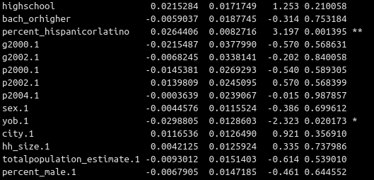
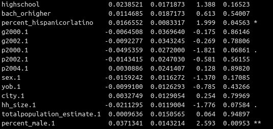
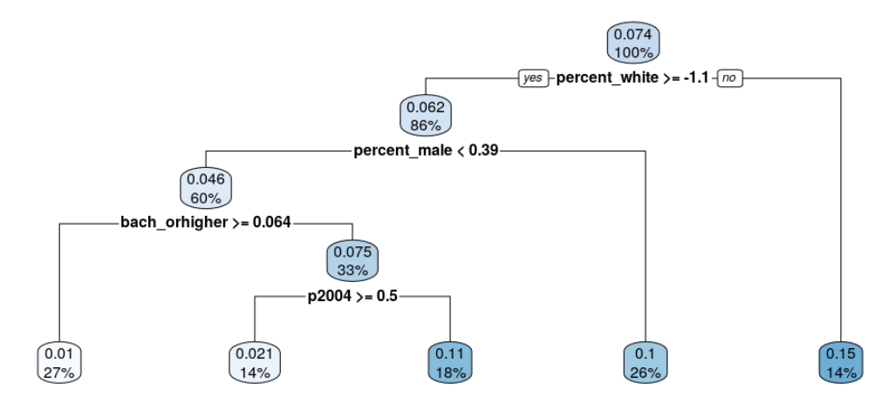
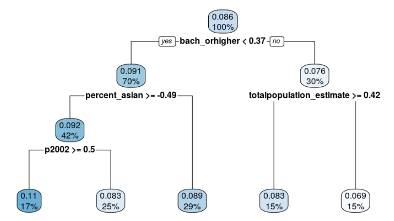
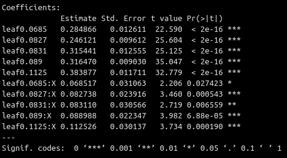
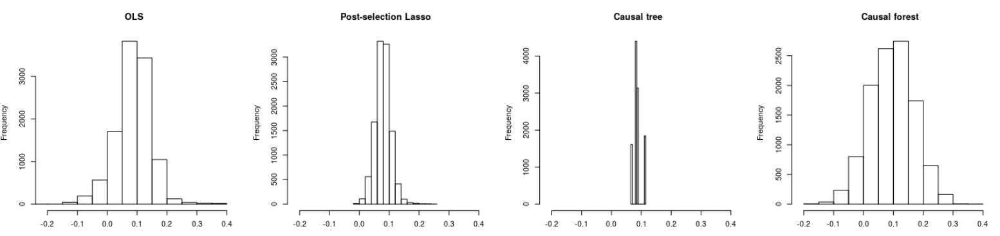
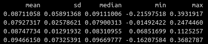
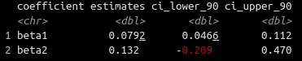
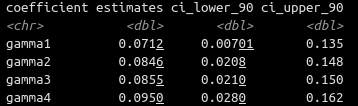

<style>
  body {background-color:lavender}
</style>

# Goal

We discuss and implement 6 different methods to estimate heterogeneous treatment effects:

- OLS with interaction terms
- Post-selection Lasso
- Causal Trees
- Causal Forests

We compare the heterogeneity identified by each of these methods. We compare the CATE of each of these methods. 

Finally, we compute the Best Linear Predictor (BLP) and the Sorted Group Average Treatment Effects (GATES).

# Set-up 

## Installation of packages 

Note that we need to install a specific package from github. 

```{r, eval=FALSE}
setwd("/home/hannah/repos/pse-ml/lab3/")

# Installs packages if not already installed, then loads packages 
list.of.packages <- c("glmnet", "rpart", "rpart.plot", "randomForest", "devtools", "tidyverse", "knitr", "SuperLearner", "caret", "xgboost")
new.packages <- list.of.packages[!(list.of.packages %in% installed.packages()[,"Package"])]
if(length(new.packages)) install.packages(new.packages, repos = "http://cran.us.r-project.org")

invisible(lapply(list.of.packages, library, character.only = TRUE))

# install causalTree package from Susan Athey's github
install_github('susanathey/causalTree')
library(causalTree)

select <- dplyr::select

# Set seed for reproducibility
set.seed(1)
```

If the above doesn't work for the `causal_tree` github package, download the .tar.gz file from [here](https://drive.google.com/open?id=1HQyYmBOlZJfSZYUkfJB79lkviYGgx3-q). In RStudio, choose Tools -> Install Packages, then pick the package archive (.tar.gz file).

If it still doesn't work, try again using `devtools` and `install_github` but do the following first: if you are using Windows, install the correct version of [RTools](https://cran.r-project.org/bin/windows/Rtools/) for your version of R; if you are using Mac, install a gcc complier such as Apple's Command Line Tools. 

## Data

The data for today's class can be found [here](https://drive.google.com/open?id=1HQyYmBOlZJfSZYUkfJB79lkviYGgx3-q) (.rds file). The data is the full dataset of the get out the vote experiment used in homework 2. I have done some basic data cleaning, including normalising the variables. 

We split the data into 3 parts. $Y$ is the outcome variable (voted or not), $X$ is the treatment variable (received letter), and the rest of the variables are $W$. Note that all the methods for today require a maximum of 2 splits. The extra split is for educational purpose.

```{r, eval=FALSE}
# Load data
my_data <- readRDS('social_voting.rds')

# Restrict the sample size
n_obs <- 33000 # Change this number depending on the speed of your computer. 6000 is also fine. 
my_data <- my_data[sample(nrow(my_data), n_obs), ]

# Split data into 3 samples
folds = createFolds(1:nrow(my_data), k=3)

Y1 <- my_data[folds[[1]],1]
Y2 <- my_data[folds[[2]],1]
Y3 <- my_data[folds[[3]],1]

X1 <- my_data[folds[[1]],2]
X2 <- my_data[folds[[2]],2]
X3 <- my_data[folds[[3]],2]

W1 <- my_data[folds[[1]],3:ncol(my_data)]
W2 <- my_data[folds[[2]],3:ncol(my_data)]
W3 <- my_data[folds[[3]],3:ncol(my_data)]

### Creates a vector of 0s and a vector of 1s of length n (hack for later usage)
zeros <- function(n) {
  return(integer(n))
}
ones <- function(n) {
  return(integer(n)+1)
}
```

# CATE, Causal trees and causal forests

## OLS with interaction terms

A simple way to estimate differential effects of $X$ on $Y$ is to include interaction terms in an OLS regression. We regress $Y$ on $X$, $W$ and the interactions between $X$ and $W$. 

```{r, eval=FALSE}
sl_lm = SuperLearner(Y = Y1, 
                     X = data.frame(X=X1, W1, W1*X1), 
                     family = binomial(), 
                     SL.library = "SL.lm", 
                     cvControl = list(V=0))

summary(sl_lm$fitLibrary$SL.lm_All$object)
```

**Question:** For which groups do we observe heterogenous effects? Are they statistically significant? 

**Question:** Repeat the above for data splits 2 and 3. Do you observe the same heterogenous effects? 





### CATE for OLS

We can use our linear model to predict the outcome with treatment and without treatment. Taking the difference between these predictions gives us an estimate for the CATE. 

$CATE = E(Y|X=1, W)-E(Y|X=0, W)$

```{r, eval=FALSE}
ols_pred_0s <- predict(sl_lm, data.frame(X=zeros(nrow(W2)), W2, W2*zeros(nrow(W2))), onlySL = T)
ols_pred_1s <- predict(sl_lm, data.frame(X=ones(nrow(W2)), W2, W2*ones(nrow(W2))), onlySL = T)

cate_ols <- ols_pred_1s$pred - ols_pred_0s$pred
```
**Question:** How can we use this CATE? 

## Post-selection Lasso

To reduce the number of variables, we can use lasso as a screening algorithm. As we know that the betas estimated by lasso are biased towards 0, we can then use OLS to estimate treatment heterogeneity. 

Step 1: select variables using lasso. 

```{r, eval=FALSE}
lasso = create.Learner("SL.glmnet", params = list(alpha = 1), name_prefix="lasso")

get_lasso_coeffs <- function(sl_lasso) {
  return(coef(sl_lasso$fitLibrary$lasso_1_All$object, s="lambda.min")[-1,])
}  

SL.library <- lasso$names
predict_y_lasso <- SuperLearner(Y = Y1,
                         X = data.frame(X=X1, W1, W1*X1), 
                         family = binomial(),
                         SL.library = SL.library, 
                         cvControl = list(V=0))

kept_variables <- which(get_lasso_coeffs(predict_y_lasso)!=0)

predict_x_lasso <- SuperLearner(Y = X1,
                          X = data.frame(W1), 
                          family = binomial(),
                          SL.library = lasso$names, 
                          cvControl = list(V=0))

kept_variables2 <- which(get_lasso_coeffs(predict_x_lasso)!=0) + 1 #+1 to include X
```

**Question:** Do we need to use Lasso to select variables $W$ that are good predictors of $X$ here? 

Step 2: Apply OLS to the chosen variables (also make sure $X$ is included if not selected by the lasso). If none of your interaction terms are selected, then lasso has not found any treatment heterogeneity. 

```{r, eval=FALSE}
sl_post_lasso <- SuperLearner(Y = Y1,
                                   X = data.frame(X=X1, W1, W1*X1)[, c(kept_variables, kept_variables2)], 
                                   family = binomial(),
                                   SL.library = "SL.lm", 
                                   cvControl = list(V=0))

summary(sl_post_lasso$fitLibrary$SL.lm_All$object)
```

**Question:** Do we observe heterogenous effects? Are they statistically significant? 

**Question:** Repeat the above for data splits 2 and 3. Do you observe the same heterogenous effects? 

### CATE for post-selection Lasso 

```{r, eval=FALSE}
postlasso_pred_0s <- predict(sl_post_lasso, data.frame(X=zeros(nrow(W2)), W2, W2*zeros(nrow(W2)))[, c(kept_variables, kept_variables2)], onlySL = T)
postlasso_pred_1s <- predict(sl_post_lasso, data.frame(X=ones(nrow(W2)), W2, W2*ones(nrow(W2)))[, c(kept_variables, kept_variables2)], onlySL = T)

cate_postlasso <- postlasso_pred_1s$pred - postlasso_pred_0s$pred
```

## Causal Trees

Reference article: Athey and Imbens (2016), [Recursive partitioning for heterogeneous causal effects](https://www.ncbi.nlm.nih.gov/pmc/articles/PMC4941430/pdf/pnas.201510489.pdf).

Here, we use the package `causalTree`, of which the documentation can be found [here](https://github.com/susanathey/causalTree/blob/master/briefintro.pdf).

Recall from the theoretical session that we grow a causal tree in order to mimimise $-\sum_i\hat{\tau}(W_i)^2$, where $\tau(W)=E(Y(1)-Y(0)|W=w)$.

```{r, eval=FALSE}
# Get formula
tree_fml <- as.formula(paste("Y", paste(names(W1), collapse = ' + '), sep = " ~ "))

### causal tree
causal_tree <- causalTree(formula = tree_fml,
                                 data = data.frame(Y=Y1, W1),
                                 treatment = X1,
                                 split.Rule = "CT", #causal tree
                                 split.Honest = F, #will talk about this next
                                 split.alpha = 1, #will talk about this next
                                 cv.option = "CT",
                                 cv.Honest = F,
                                 split.Bucket = T, #each bucket contains bucketNum treated and bucketNum control units
                                 bucketNum = 5, 
                                 bucketMax = 100, 
                                 minsize = 250) # number of observations in treatment and control on leaf

rpart.plot(causal_tree, roundint = F)
```


**Question:** How do you read the tree? 

The number of buckets is determined by min(`bucketMax`, max(`n_min`/`bucketNum`, `minsize`)) observations, where `n_min` is the minimum of the number of treated observations and the number of control observations in the leaf to be split.

**Question:** Modify the parameters `bucketMax`, `bucketNum` and `minsize` to obtain fewer or more splits. How many splits seems reasonable, and why? 

### Honest Causal Trees

The key idea here is to use half of the data to find out where the heterogenous treatment effect is, and the other half of the data to estimate the treatment effect of each leaf of the partition. 

In order to decide the splits of the tree, treatment effect heterogeneity is rewarded and high variance in estimation of treatment effect is penalized. The weight given to the former is $\alpha$ and the weight given to the latter is $1-\alpha$. (See Comment 1 in slide 11 for the equation.)

```{r, eval=FALSE}
honest_tree <- honest.causalTree(formula = tree_fml,
                                 data = data.frame(Y=Y1, W1),
                                 treatment = X1,
                                 est_data = data.frame(Y=Y2, W2),
                                 est_treatment = X2,
                                 split.alpha = 0.5,
                                 split.Rule = "CT",
                                 split.Honest = T,
                                 cv.alpha = 0.5,
                                 cv.option = "CT",
                                 cv.Honest = T,
                                 split.Bucket = T,
                                 bucketNum = 5,
                                 bucketMax = 100, # maximum number of buckets
                                 minsize = 250) # number of observations in treatment and control on leaf

rpart.plot(honest_tree, roundint = F)
```

We prune the tree using cross validation, that is, we choose the simplest tree that minimises the objective function in a left-out sample. 

```{r, eval=FALSE}
opcpid <- which.min(honest_tree$cp[, 4]) 
opcp <- honest_tree$cp[opcpid, 1]
honest_tree_prune <- prune(honest_tree, cp = opcp)

rpart.plot(honest_tree_prune, roundint = F)
```


We can estimate the standard errors on the leaves using a simple OLS. 

```{r, eval=FALSE}
### there will be an error here if your pruned tree has no leaves
leaf2 <- as.factor(round(predict(honest_tree_prune,
                                       newdata = data.frame(Y=Y2, W2),
                                       type = "vector"), 4))

# Run linear regression that estimate the treatment effect magnitudes and standard errors
honest_ols_2 <- lm( Y ~ leaf + X * leaf - X -1, data = data.frame(Y=Y2, X=X2, leaf=leaf2, W2))

summary(honest_ols_2)
```


**Question:** Re-run the previous code block on split 3. Are the results different?

### CATE for honest trees

```{r, eval=FALSE}
cate_honesttree <- predict(honest_tree_prune, newdata = data.frame(Y=Y2, W2), type = "vector")
```

## Causal Forests

A causal forest is essentially a random forest of honest causal trees. 

```{r, eval=FALSE}
# Causal forests 
causalforest <- causalForest(tree_fml,
                             data=data.frame(Y=Y1, W1), 
                             treatment=X1, 
                             split.Rule="CT", 
                             split.Honest=T,  
                             split.Bucket=T, 
                             bucketNum = 5,
                             bucketMax = 100, 
                             cv.option="CT", 
                             cv.Honest=T, 
                             minsize = 2, 
                             split.alpha = 0.5, 
                             cv.alpha = 0.5,
                             sample.size.total = floor(nrow(Y1) / 2), 
                             sample.size.train.frac = .5,
                             mtry = ceiling(ncol(W1)/3), 
                             nodesize = 5, 
                             num.trees = 10, 
                             ncov_sample = ncol(W1), 
                             ncolx = ncol(W1))
```

**Question: ** Do we have a nice tree representation as we do for honest causal trees?

### CATE for causal forests

```{r, eval=FALSE}
cate_causalforest <- predict(causalforest, newdata = data.frame(Y=Y2, W2), type = "vector")
```

*Note*: For the causal forest, you can use out-of-the-bag prediction to train and test on the same data. This is because the trees in an honest causal forest only use part of the observations for training. This is implemented in the package `grf` (but not in `causalTree` as far as I can tell).

## Recap 

We have estimated the CATE on split 2 using OLS, Post-selection Lasso, Honest Trees and Causal Forests. For the former three, we have selected variables $W$ where there are heterogenous treatement effects. For the latter, there is less interpretability. 

How do the estimates of the CATE compare? 

```{r, eval=FALSE}
## Compare Heterogeneity
het_effects <- data.frame(ols = cate_ols, 
                     post_selec_lasso = cate_postlasso, 
                     causal_tree = cate_honesttree, 
                     causal_forest = cate_causalforest)

# Set range of the x-axis
xrange <- range( c(het_effects[, 1], het_effects[, 2], het_effects[, 3], het_effects[, 4]))

# Set the margins (two rows, three columns)
par(mfrow = c(2, 4))

hist(het_effects[, 1], main = "OLS", xlim = xrange)
hist(het_effects[, 2], main = "Post-selection Lasso", xlim = xrange)
hist(het_effects[, 3], main = "Causal tree", xlim = xrange)
hist(het_effects[, 4], main = "Causal forest", xlim = xrange)
```



Table of results: 

```{r, eval=FALSE}
# Summary statistics
summary_stats <- do.call(data.frame, 
                         list(mean = apply(het_effects, 2, mean),
                              sd = apply(het_effects, 2, sd),
                              median = apply(het_effects, 2, median),
                              min = apply(het_effects, 2, min),
                              max = apply(het_effects, 2, max)))

summary_stats
```



# Best Linear Predictor (BLP)

We estimate $\beta_1$ and $\beta_2$ in the following equation: 

$$Y = \alpha'W  + \beta_1(X- p(W)) + \beta_2 (X - p(W))(\hat{\tau}(W)-E[\hat{\tau}(W)]) + \epsilon$$
```{r, eval=FALSE}
blp <- function(Y, W, X, prop_scores=F) {
  
  ### STEP 1: split the dataset into two sets, 1 and 2 (50/50)
  split <- createFolds(1:length(Y), k=2)[[1]]
  
  Ya = Y[split]
  Yb = Y[-split]
  
  Xa = X[split]
  Xb = X[-split]
  
  Wa = W[split, ]
  Wb = W[-split, ]
  
  ### STEP 2a: (Propensity score) On set A, train a model to predict X using W. Predict on set B.
  if (prop_scores==T) {
    sl_w1 = SuperLearner(Y = Xa, 
                         X = Wa, 
                         newX = Wb, 
                         family = binomial(), 
                         SL.library = "SL.xgboost", 
                         cvControl = list(V=0))
    
    p <- sl_w1$SL.predict
  } else {
    p <- rep(mean(Xa), length(Xb))
  }

  ### STEP 2b let D = W(set B) - propensity score.
  D <- Xb-p
  
  ### STEP 3a: Get CATE (for example using xgboost) on set A. Predict on set B.
  sl_y = SuperLearner(Y = Ya, 
                       X = data.frame(X=Xa, Wa), 
                       family = gaussian(), 
                       SL.library = "SL.xgboost", 
                       cvControl = list(V=0))
  
  pred_y1 = predict(sl_y, newdata=data.frame(X=ones(nrow(Wb)), Wb))
  
  pred_0s <- predict(sl_y, data.frame(X=zeros(nrow(Wb)), Wb), onlySL = T)
  pred_1s <- predict(sl_y, data.frame(X=ones(nrow(Wb)), Wb), onlySL = T)

  cate <- pred_1s$pred - pred_0s$pred
  
  ### STEP 3b: Subtract the expected CATE from the CATE
  C = cate-mean(cate)
  
  ### STEP 4: Create a dataframe with Y, W (set B), D, C and p. Regress Y on W, D and D*C. 
  df <- data.frame(Y=Yb, Wb, D, C, p)

  Wnames <- paste(colnames(Wb), collapse="+")
  fml <- paste("Y ~",Wnames,"+ D + D:C")
  model <- lm(fml, df, weights = 1/(p*(1-p))) 
  
  return(model) 
}
```

Turn the BLP into a nice table:

```{r, eval=FALSE}
table_from_blp <-function(model) {
  thetahat <- model%>% 
    .$coefficients %>%
    .[c("D","D:C")]
  
  # Confidence intervals
  cihat <- confint(model)[c("D","D:C"),]
  
  res <- tibble(coefficient = c("beta1","beta2"),
                estimates = thetahat,
                ci_lower_90 = cihat[,1],
                ci_upper_90 = cihat[,2])
  
  return(res)
}
```

Repeat for inference:

```{r, eval=FALSE}
output <- rerun(10, table_from_blp(blp(Y1, W1, X1))) %>% # Increase reruns in practice!
  bind_rows %>%
  group_by(coefficient) %>%
  summarize_all(median)

output
```



This is a 90% confidence interval and not a 95% confidence interval, because we double the uncertainty by randomly splitting our sample. 

# Sorted Group Average Treatment Effects (GATES)

The GATES are given by: 

$$\gamma_k = E[\tau(W) \  | \ G_{k} ]$$

Where $G_k$ ist the $k^{th}$ n-tile of estimated $\hat{\tau}(W)$.

Where, if consistency actually holds, we expect:

$$E[\tau(W) \  | \ G_{1}] \leq \cdots \leq E[\tau(W) \  | \ G_{K}]$$

We estimate $\gamma_k$ in the linear function:

$$Y_i = Wi\beta  + \sum_k\gamma_{k}\cdot (X_i - p(W_i)) \cdot 1\{ i \in G_{k}\}  + \epsilon_i$$

where $E[\omega(W)\epsilon X] = 0$ and where $p(\cdot)$ is the propensity score, and weights $\omega(w) = \frac{1}{p(w)(1 - p(w))}$. 

We create a function called `gates` that computes these estimates and standard errors.

We need 2 splits of data. The first split is to estimate the CATE function $\tau(W)$ and to estimate the propensity score function $p(W)$. The other split is to predict the CATE (and hence the $G_k$), to predict the propensity score and to estimate the $\gamma_k$ in the above linear equation. 

```{r, eval=FALSE}
gates <- function(Y, W, X, Q=4, prop_scores=F) {
  
  ### STEP 1: split the dataset into two sets, 1 and 2 (50/50)
  split <- createFolds(1:length(Y), k=2)[[1]]
  
  Ya = Y[split]
  Yb = Y[-split]
  
  Xa = X[split]
  Xb = X[-split]
  
  Wa = W[split, ]
  Wb = W[-split, ]
  
  ### STEP 2a: (Propensity score) On set A, train a model to predict X using W. Predict on set B.
  if (prop_scores==T) {
    sl_w1 = SuperLearner(Y = Xa, 
                         X = Wa, 
                         newX = Wb, 
                         family = binomial(), 
                         SL.library = "SL.xgboost", 
                         cvControl = list(V=0))
    
    p <- sl_w1$SL.predict
  } else {
    p <- rep(mean(Xa), length(Xb))
  }

  ### STEP 2b let D = W(set B) - propensity score.
  D <- Xb-p
  
  ### STEP 3a: Get CATE (for example using xgboost) on set A. Predict on set B.
  sl_y = SuperLearner(Y = Ya, 
                       X = data.frame(X=Xa, Wa), 
                       family = gaussian(), 
                       SL.library = "SL.xgboost", 
                       cvControl = list(V=0))
  
  pred_y1 = predict(sl_y, newdata=data.frame(X=ones(nrow(Wb)), Wb))
  
  pred_0s <- predict(sl_y, data.frame(X=zeros(nrow(Wb)), Wb), onlySL = T)
  pred_1s <- predict(sl_y, data.frame(X=ones(nrow(Wb)), Wb), onlySL = T)

  cate <- pred_1s$pred - pred_0s$pred
  
  ### STEP 3b: divide the cate estimates into Q tiles, and call this object G. 
  # Divide observations into n tiles
  G <- data.frame(cate) %>% # replace cate with the name of your predictions object
    ntile(Q) %>%  # Divide observations into Q-tiles
    factor()
  
  ### STEP 4: Create a dataframe with Y, W (set B), D, G and p. Regress Y on group membership variables and covariates. 
  df <- data.frame(Y=Yb, Wb, D, G, p)
  
  Wnames <- paste(colnames(Wb), collapse="+")
  fml <- paste("Y ~",Wnames,"+ D:G")
  model <- lm(fml, df, weights = 1/(p*(1-p))) 
  
  return(model) 
}
```

Turn the GATES into a nice table:

```{r, eval=FALSE}
table_from_gates <-function(model) {
  thetahat <- model%>% 
    .$coefficients %>%
    .[c("D:G1","D:G2","D:G3","D:G4")]
  
  # Confidence intervals
  cihat <- confint(model)[c("D:G1","D:G2","D:G3","D:G4"),]
  
  res <- tibble(coefficient = c("gamma1","gamma2","gamma3","gamma4"),
                estimates = thetahat,
                ci_lower_90 = cihat[,1],
                ci_upper_90 = cihat[,2])
  
  return(res)
}
```

Repeat for inference:

```{r, eval=FALSE}
output <- rerun(10, table_from_gates(gates(Y1, W1, X1))) %>% # Increase reruns in practice!
  bind_rows %>%
  group_by(coefficient) %>%
  summarize_all(median)

output
```



This is a 90% confidence interval and not a 95% confidence interval, because we double the uncertainty by randomly splitting our sample. 

**Question:** Why could the groups not be monotonically increasing? 

# Bibliography

Some of this lab material was inspired by Susan Athey’s tutorials [here](https://drive.google.com/drive/folders/1SEEOMluxBcSAb_tsDYgcLFtOQaeWtkLp), written by Susan Athey, Vitor Hadad and Nicolaj Naargaard Mahlbach.
